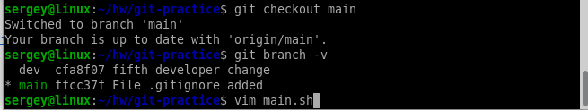
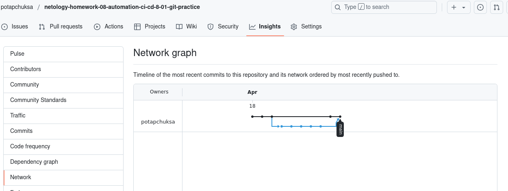

# Домашнее задание к занятию «Git». Потапчук Сергей.

### Инструкция по выполнению домашнего задания

   1. Сделайте `fork` [репозитория c шаблоном решения](https://github.com/netology-code/sys-pattern-homework) к себе в GitHub и переименуйте его по названию или номеру занятия, например, https://github.com/имя-вашего-репозитория/gitlab-hw или https://github.com/имя-вашего-репозитория/8-03-hw.
   2. Выполните клонирование этого репозитория к себе на ПК с помощью команды `git clone`.
   3. Выполните домашнее задание и заполните у себя локально этот файл README.md:
      - впишите сверху название занятия, ваши фамилию и имя;
      - в каждом задании добавьте решение в требуемом виде — текст, код, скриншоты, ссылка;
      - для корректного добавления скриншотов используйте [инструкцию «Как вставить скриншот в шаблон с решением»](https://github.com/netology-code/sys-pattern-homework/blob/main/screen-instruction.md);
      - при оформлении используйте возможности языка разметки md. Коротко об этом можно посмотреть в [инструкции  по MarkDown](https://github.com/netology-code/sys-pattern-homework/blob/main/md-instruction.md).
   4. После завершения работы над домашним заданием сделайте коммит `git commit -m "comment"` и отправьте его на GitHub `git push origin`.
   5. Для проверки домашнего задания в личном кабинете прикрепите и отправьте ссылку на решение в виде md-файла в вашем GitHub.
   6. Любые вопросы по выполнению заданий задавайте в чате учебной группы или в разделе «Вопросы по заданию» в личном кабинете.
   
Желаем успехов в выполнении домашнего задания!

---

### Задание 1

**Что нужно сделать:**

1. Зарегистрируйте аккаунт на [GitHub](https://github.com/).
1. Создайте  **новый отдельный публичный репозиторий**. Обязательно поставьте галочку в поле «Initialize this repository with a README».
2. Склонируйте репозиторий, используя https протокол `git clone ...`.
3. Перейдите в каталог с клоном репозитория.
1. Произведите первоначальную настройку Git, указав своё настоящее имя и email: `git config --global user.name` и `git config --global user.email johndoe@example.com`.
1. Выполните команду `git status` и запомните результат.
1. Отредактируйте файл README.md любым удобным способом, переведя файл в состояние Modified.
1. Ещё раз выполните `git status` и продолжайте проверять вывод этой команды после каждого следующего шага.
1. Посмотрите изменения в файле README.md, выполнив команды `git diff` и `git diff --staged`.
1. Переведите файл в состояние staged или, как говорят, добавьте файл в коммит, командой `git add README.md`.
1. Ещё раз выполните команды `git diff` и `git diff --staged`.
1. Теперь можно сделать коммит `git commit -m 'First commit'`.
1. Сделайте `git push origin master`.

В качестве ответа добавьте ссылку на этот коммит в ваш md-файл с решением.

### Решение

Создал репозиторий с файлом README.md.

Скапировал ссылку. 

Склонировал репозиторий сразу в нужную папку.

Произвел первоначальную настройку.

Посмотрел статус.

Изменил README.md.

Было.

Стало.

Проверил статус.

Проверил разницу в каталоге и индексе.

Добавил изменения в индекс, и проверил статус.

Проверил разницу в каталоге и индексе.

Сделал коммит, и проверил статус.

Запушил изменения в удаленный репозиторий, и проверил статус (в задании ошибка: на GitHub главная ветка теперь называется main, а не master).

[Ссылка на коммит](https://github.com/potapchuksa/netology-homework-08-automation-ci-cd-8-01-git-practice/commit/452ad8813c81de894aa8525c1d92427b7e11b79f)

[Ссылка на файл](https://github.com/potapchuksa/netology-homework-08-automation-ci-cd-8-01-git-practice/blob/452ad8813c81de894aa8525c1d92427b7e11b79f/README.md)

---

### Задание 2

**Что нужно сделать:**

1. Создайте файл .gitignore (обратите внимание на точку в начале файла) и проверьте его статус сразу после создания.
1. Добавьте файл .gitignore в следующий коммит `git add...`.
1. Напишите правила в этом файле, чтобы игнорировать любые файлы `.pyc`, а также все файлы в директории `cache`.
1. Сделайте коммит и пуш.

В качестве ответа добавьте ссылку на этот коммит в ваш md-файл с решением.

### Решение

Создал файл .gitignore, и проверил статус.

Добавил его в индекс, и проверил статус.

Изменил файл в соответствии с заданием.

Проверил статус.

Сделал коммит, чтобы изменения файла .gitignore попали в коммит добавил опцию -a, проверил статус

Запушил в удаленный репозиторий, и проверил статус.

[Ссылка на коммит](https://github.com/potapchuksa/netology-homework-08-automation-ci-cd-8-01-git-practice/commit/ffcc37fe8fa57e87eb2710209af77008687a57e0)

---

### Задание 3

**Что нужно сделать:**

1. Создайте новую ветку dev и переключитесь на неё.
2. Создайте в ветке dev файл test.sh с произвольным содержимым.
3. Сделайте несколько коммитов и пушей  в ветку dev, имитируя активную работу над  файлом в процессе разработки.
4. Переключитесь на основную ветку.
5. Добавьте файл main.sh в основной ветке с произвольным содержимым, сделайте комит и пуш . Так имитируется продолжение общекомандной разработки в основной ветке во время разработки отдельного функционала в dev  ветке.
6. Сделайте мердж dev  ветки в основную с помощью git merge dev. Напишите осмысленное сообщение в появившееся окно комита.
7. Сделайте пуш в основной ветке.
8. Не удаляйте ветку dev.

В качестве ответа прикрепите ссылку на граф коммитов https://github.com/ваш-логин/ваш-репозиторий/network в ваш md-файл с решением.

Ваш граф комитов должен выглядеть аналогично скриншоту:   

### Решение

Создал новую ветку, проверил статус, и создал новый файл test.sh

с таким содержимым.

Добавил его в индекс, закоммитил, и еще несколько раз изменял, добавлял в индекс и коммитил.

Переключился на основную ветку и создал файл main.sh

с таким содержимым.

Добавил его в индекс, закоммитил, и запушил на удаленный репозиторий.

Влил ветку dev в main.

Запушил изменения в удаленный репозиторий.

Проверил как выглядит граф в удаленном репозитории.

Так он выглядит в локальном.

[Ссылка на граф](https://github.com/potapchuksa/netology-homework-08-automation-ci-cd-8-01-git-practice/network)

---
## Дополнительные задания* (со звёздочкой)

Их выполнение необязательное и не влияет на получение зачёта по домашнему заданию. Можете их решить, если хотите лучше разобраться в материале.
---

### Задание 4*

Сэмулируем конфликт. Перед выполнением изучите [документацию](https://git-scm.com/book/ru/v2/%D0%98%D0%BD%D1%81%D1%82%D1%80%D1%83%D0%BC%D0%B5%D0%BD%D1%82%D1%8B-Git-%D0%9F%D1%80%D0%BE%D0%B4%D0%B2%D0%B8%D0%BD%D1%83%D1%82%D0%BE%D0%B5-%D1%81%D0%BB%D0%B8%D1%8F%D0%BD%D0%B8%D0%B5).

**Что нужно сделать:**

1. Создайте ветку conflict и переключитесь на неё.
2. Внесите изменения в файл test.sh. 
3. Сделайте коммит и пуш.
4. Переключитесь на основную ветку.
5. Измените ту же самую строчку в файле test.sh.
6. Сделайте коммит и пуш.
7. Сделайте мердж ветки conflict в основную ветку и решите конфликт так, чтобы в результате в файле оказался код из ветки conflict.

В качестве ответа на задание прикрепите ссылку на граф коммитов https://github.com/ваш-логин/ваш-репозиторий/network в ваш md-файл с решением.

### Решение

Создал ветку conflict, переключился на нее, и изменил файл test.sh.

Новое содержимое файла.

Добавил в индекс, сделал коммит и пуш.

Переключился на ветку main, и изменил файл test.sh.

Новое содержимое файла.

Добавил в индекс, сделал коммит и пуш.

Влил ветку conflict в main. Гит указал на конфликт в файле test.sh, поэтому буду решать конфликт вручную. Открою файл test.sh.

Было.

Отредактировал.

Добавил test.sh в индекс, закоммитил и запушил.

Проверил граф.

[Ссылка на граф](https://github.com/potapchuksa/netology-homework-08-automation-ci-cd-8-01-git-practice/network)

---
